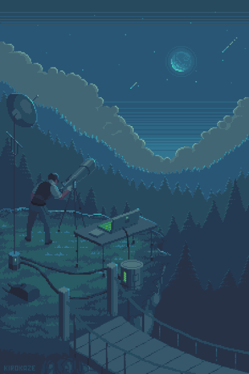

<p align="center">
  
  
  
  
</p>

```diff
+ [LOG] Dome opened. Mount slewing to target...
+ [LOG] Plate solve OK — target V1096 Her locked.
+ [LOG] RA 17h 28m 44.996s / DEC +43° 48' 12.905"  (first light, first star)
! [WARN] Seeing 3.4" and rising. Increasing guide exposure.
- [ERR] Cloud sensor tripped at 78%. Sequence paused.
+ [LOG] Calibration frames applied. Signal is clean. Welcome in.
```

# Welcome to the observation deck



I'm an astronomer based in Türkiye, working toward astrophysics and data science.
I spend most of my time in the narrow strip
where celestial mechanics, signal processing and shipping actual software overlap — writing
the code that turns a night of raw photons into something you can reason about.

The work splits roughly in two. On one side there is precision: ephemerides, coordinate
transforms, plate solving, refraction — the arithmetic that has to be correct before anything
downstream is worth doing. On the other side there is volume: catalog cross-matching,
photometry across thousands of frames, the kind of problem where the answer only shows up
after the data has been cleaned properly. Both halves are more interesting than they sound.

The rest of it is hardware, and hardware is where the theory goes to get humbled. A mount that
refuses to guide. A camera that silently drops frames. A single-board computer sitting in a cold
box at the far end of a long cable, three hours from the nearest keyboard. Most observatory
software is written for the nights when everything works. I am more interested in the other
nights, because those are the ones that actually cost you data.

So most of what lives in these repos started as a problem I had at 3 a.m. under a bad sky.
The solutions aren't always elegant, but they are tested against reality rather than against
an assumption of it. If you spot something that can be done better, fork it, open a PR, or file
an issue — I'm always up for a better method, and I would rather be corrected than consistent.

Two ideas run underneath nearly all of it:

- **Observation** — you cannot correct what you have not measured. Bias, dark, flat: the boring
  frames are the ones that quietly decide whether the science survives.
- **Propulsion** — a model that never leaves the notebook has zero thrust. Build it, launch it,
  read the telemetry, iterate, and let the failure modes teach you something.

<br clear="right" />

<sub>Artwork: <a href="https://www.behance.net/gallery/37020725/Moonlight-gif-animation">&quot;Moonlight&quot; by Kirokaze</a> — used with permission.</sub>

> *Every photon that lands on the sensor has been travelling for centuries to get here.
> The least I can do is calibrate it properly.*

---

## Current Ops

- **Aperio** — native multi-device app for professional astronomers: high-precision
  ephemeris engine, multi-catalog enrichment (SIMBAD, VizieR, Gaia, 2MASS, AllWISE),
  weather-aware observability scoring, telescope control over ASCOM Alpaca / NINA.
- **Kreiken Observatory** — Python automation stack for remote observing: scheduling,
  plate solving, autoguiding, automated calibration and reduction pipelines.
- **Learning next** — ASCOM Alpaca as a cross-platform REST layer, and Raspberry Pi based
  observatory controllers.

---

## General Info

- **Fun fact**: I build rockets on the ground and photograph the things they aim for.
- **Off-screen**: Electric guitar, airsoft, and far too many clear-sky forecasts.
- **Languages**: Türkçe (native) · English
- **How to reach me**:
  [](mailto:korhankara98@pm.me)
  [](https://korhankara.com)

<p align="center">
  
  
  
  
  
  
</p>

---

## Instruments, tools and stuff

### Operating Systems


### Languages


### Astronomy & Imaging


### Data Science & ML


### Mobile & App Development


### Hardware & Embedded


### Rocketry & CAD


### Security & Privacy


### Browsers & Internet


### Platforms & Tooling


---

<p align="center">
  <sub><code>[LOG] Session closed. Data archived. Clear skies.</code></sub>
</p>
